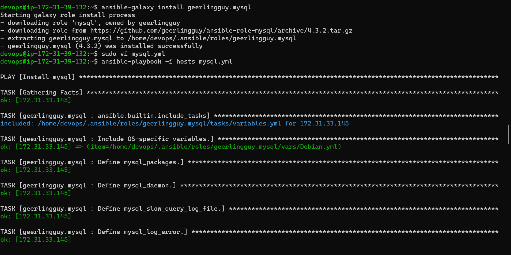
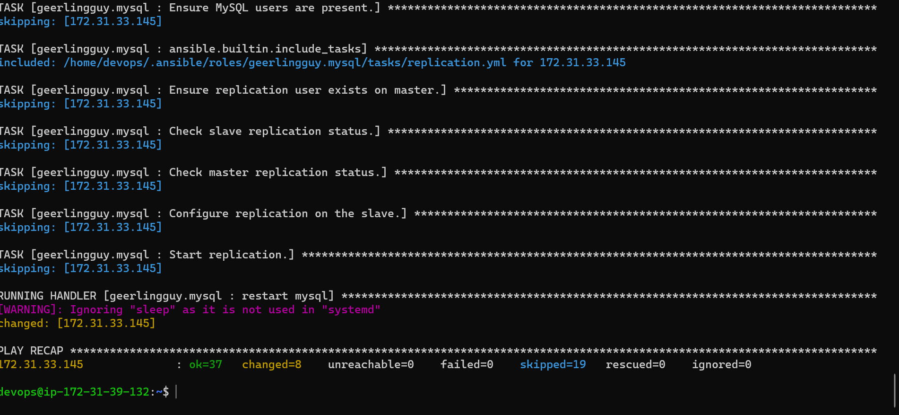
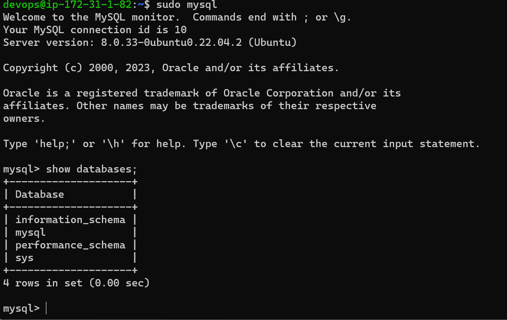
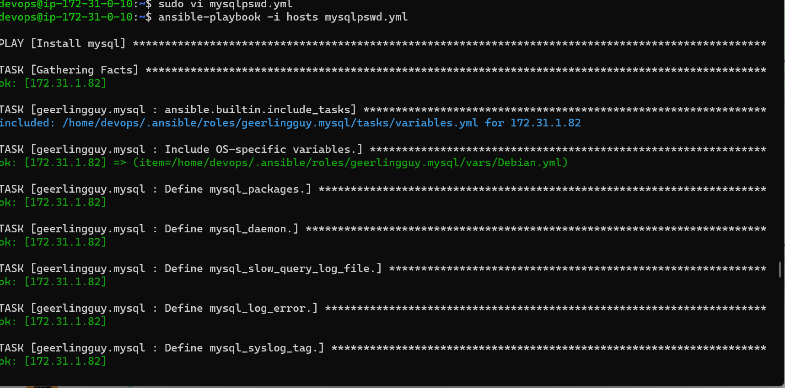
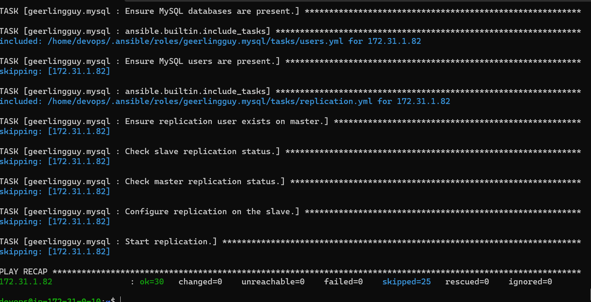
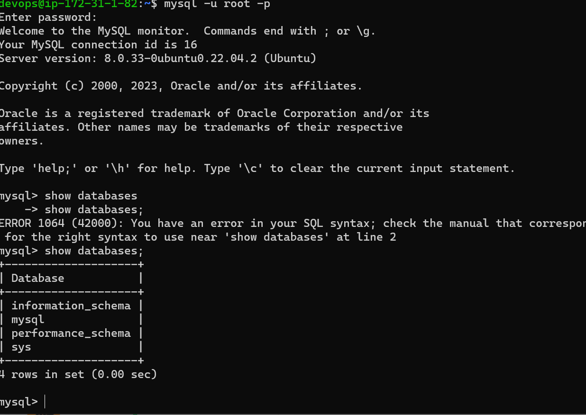

### using a role for mysql from ansible galaxy

Install mysql role using `https://galaxy.ansible.com/geerlingguy/mysql`

writing a playbook to call for mysql role

```
- name: Install mysql
  hosts: all
  become: yes
  roles:
    - role: geerlingguy.mysql
  vars:
    mysql_bind_address: 0.0.0.0

```






### using a role for mysql with password

```
- name: Install mysql
  hosts: all
  become: yes
  roles:
    - role: geerlingguy.mysql
  vars:
    mysql_bind_address: 0.0.0.0
    mysql_root_username: root
    mysql_root_password: root

```

The output is as follows







