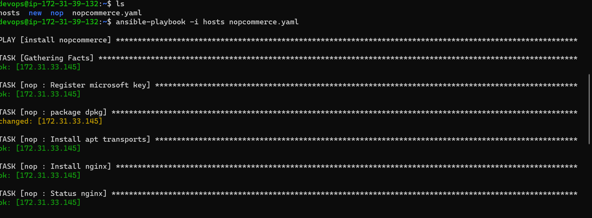
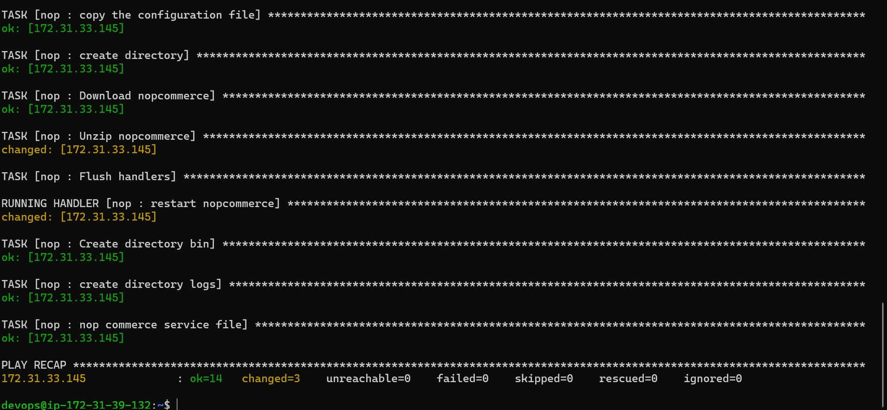
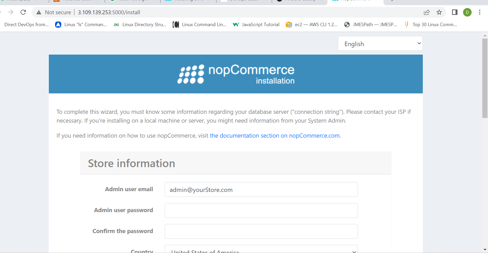

### creating a role for any application

* Role: It is a reusable playbook.

* Actually `modules` are not reusable playbooks.But `Roles` are reusable.

* we can create our own roles.

* Roles will automatically create vars, files, tasks, handlers, and other Ansible artifacts.

* In Roles we need to group our content in specified folders which are given by  default while creating a role,i.e., keeping handlers in handlers folder,tasks in tasks folder,templates in template folder,after that you can easily reuse them and share them with other users.

* [refer here]https://docs.ansible.com/ansible/latest/playbook_guide/playbooks_reuse_roles.html for brief idea

* To use the role [refer here]https://galaxy.ansible.com/

* search for the role (for example if you want tomcat search for tomcat in the search bar and using filter select role as of now) 

* you can use the role created by others just by using a single line `role`.

* To create a Role use the command `ansible-galaxy role init <name_of_role>` the role get creates.

* After role creation by using sftp to download the role into your local system by using get -r <name_of_role>
  
* ### create a role for nopcommerce
```
---
- name: install nopcommerce
  become: yes
  hosts: all
  roles:
    - nopcommerce
```
command to run the playbook for calling role

yaml file should be inside the role (the role we created)

`ansible-playbook -i hosts nopcommerce.yml`





The output of the nopcommerce is as follows



