### Installing and configuring ansible
 * creating two ubuntu vms and one redhat vm.
 * we will name one ubuntu vm as ansible control node,another ubuntu vm as node1.
 * Redhat vm as node2. 
 * creating a user 'devops' in two vms with sudo permissions.
  
   

 * Generate a keypair in ansible control node.
  
   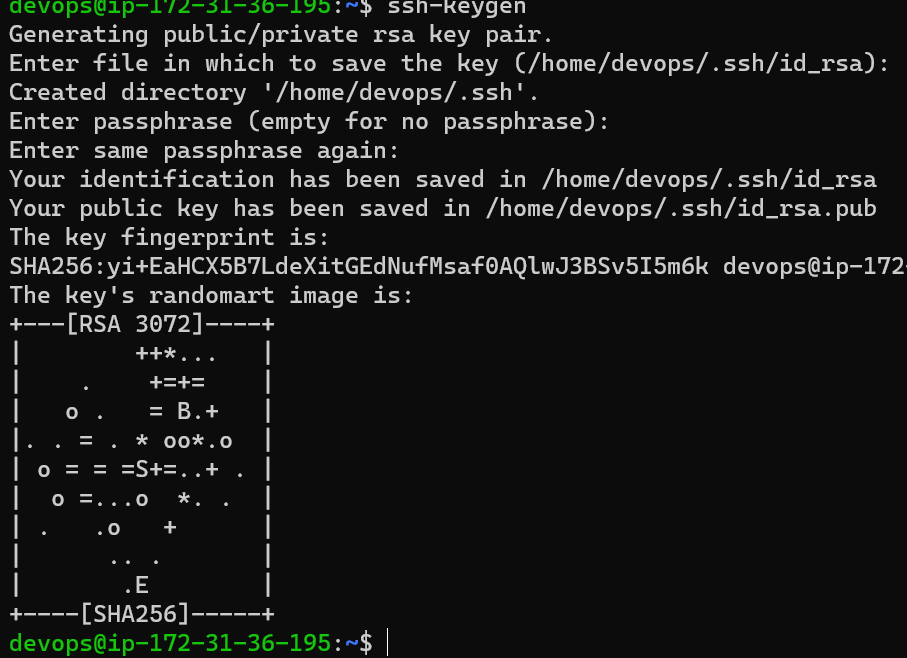

 * copy the publickey to other vms from ansible control node.
   
   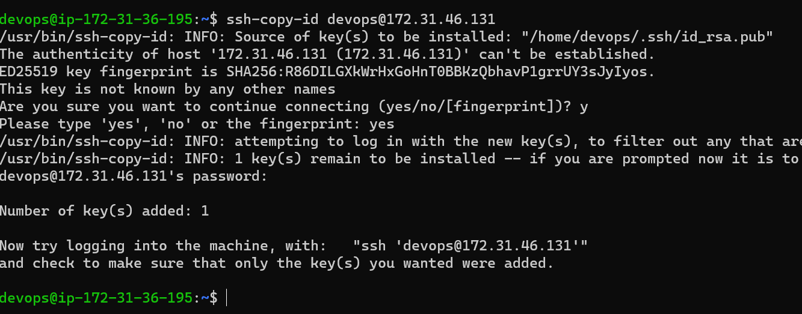

 * Install Ansible in Ansible control node.
   
   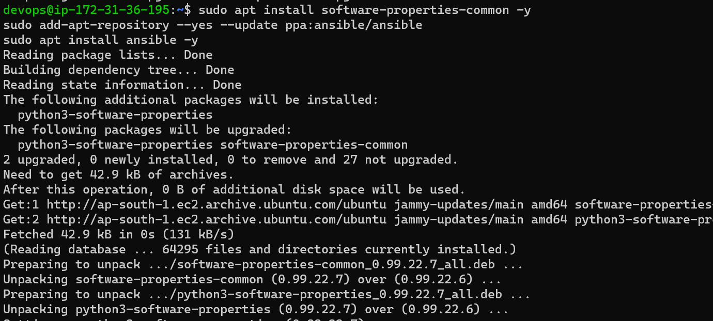

 * After installation u can verify the ansible version
  
   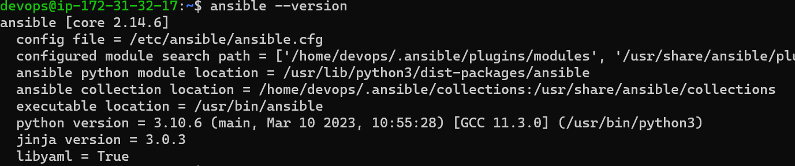

 *  We need to create an inventory with file named as hosts and with ipaddress in it.
 
 *  Now enable password authentications by editing config file
   
    ```
    /etc/ssh/sshd_config
    ```

 * and set password authentication from no to yes.
 * Execute sshd restart service
   
   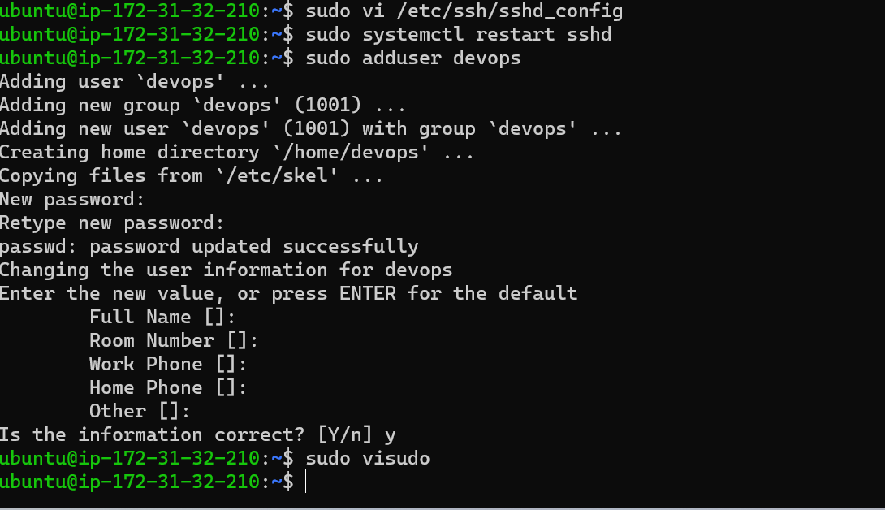
  
  # Installing lamp server on ubuntu

 * create a directory with playbooks and ubuntu.yml file in it.
   
   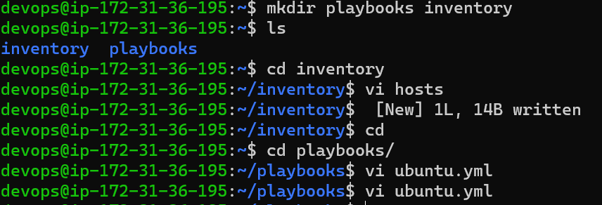

 * ubuntu.yml file contains playbook 
   
   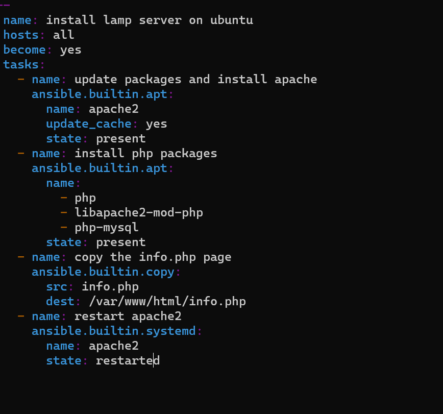

 * create a file info.php
   
   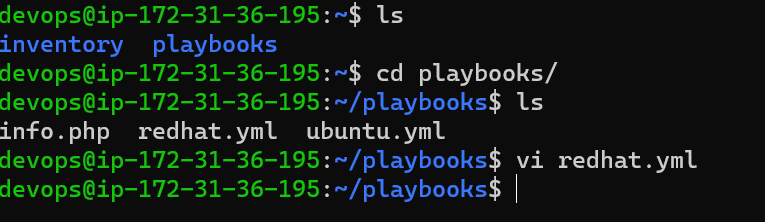

    ```
    <?php phpinfo(); ?>
    ``` 
 *  check the connectivity by executing 
   
    ```
    ansible -m ping -i hosts all
    ```

    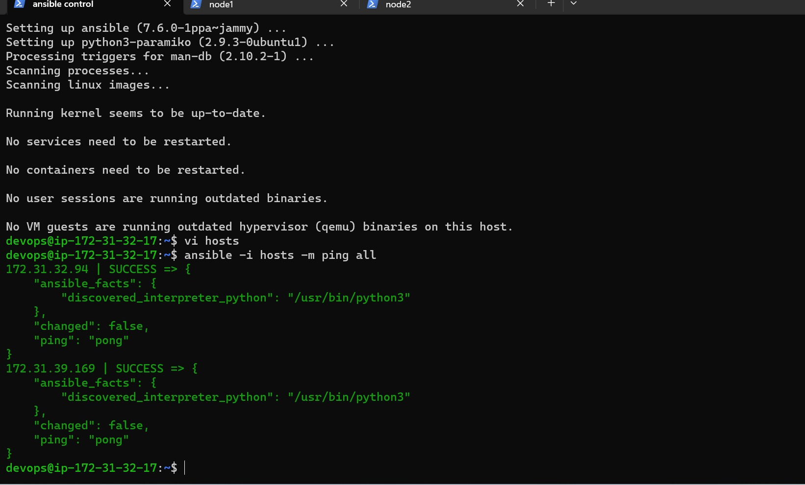

 * we need to check the syntax of playbook
   ```
   ansible-playbook -i <inventory-path> --syntax-check <playbook-path>
   ```

 * Execute the playbook 
  
   ```
   ansible-playbook -i <inventory-path> <playbook-path>
   ```
   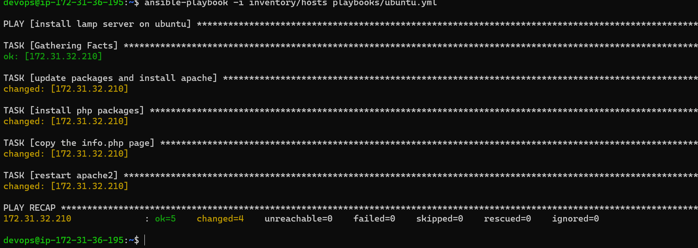

 * cross check the installation
  
   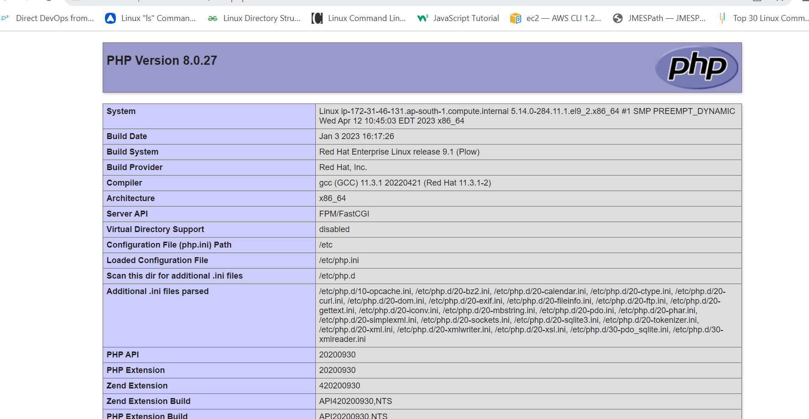
 
 # Installing lamp server on Redhat
 * create redhat.yml file in playbooks directory.
  
   
  
 * Execute the playbook 
  
   ```
   ansible-playbook -i <inventory-path> <playbook-path>
   ```
   

 * verify the installation
   
   

 