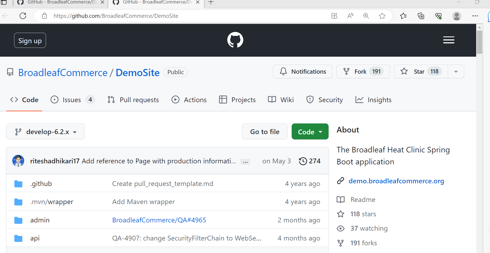
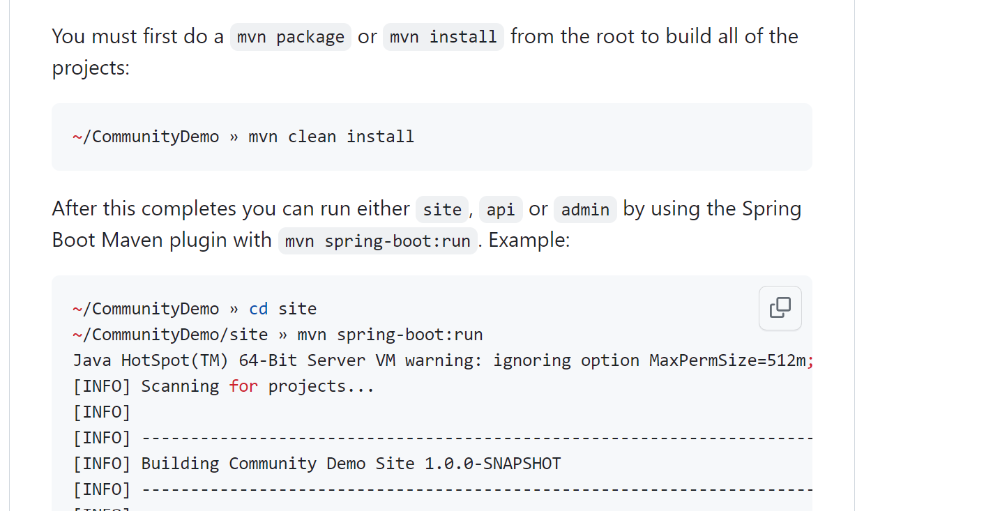

## playbook for broadleaf commerce application.

[Refer here]https://khajaworkspace.slack.com/archives/D059G0S487Q/p1686154331416509  repository where the broadleaf application is present.

we need to clone the application from the repository which is in remote machine to the local machine.

The command for cloning is `git clone`(url of repository)


Install maven using `sudo apt install maven`

next follow the manual commands 


As of now there is no service file for this application .

The playbook for broadleaf commerce is

```
- name: BROADLEAF COMMERCE
  hosts: all
  become: yes
  tasks:
    - name: cloning from git
      ansible.builtin.git:
        repo: https://github.com/BroadleafCommerce/DemoSite.git
        dest: /home/devops/DemoSite
    - name: Install maven
      ansible.builtin.apt:
        name: maven
        update_cache: yes
        state: present
    - name: clean install maven
      ansible.builtin.shell:
        chdir: /home/devops/DemoSite
        cmd: mvn clean install
    - name: copy the service file
      ansible.builtin.copy:
        src: broadleaf.service
        dest: /etc/systemd/system/
    - name: broadleaf service
      ansible.builtin.systemd:
        name: broadleaf.service
        daemon-reload: true
        state: restarted
```

