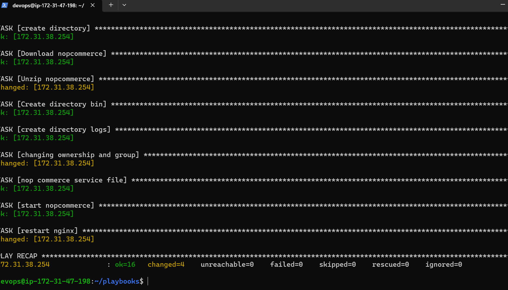
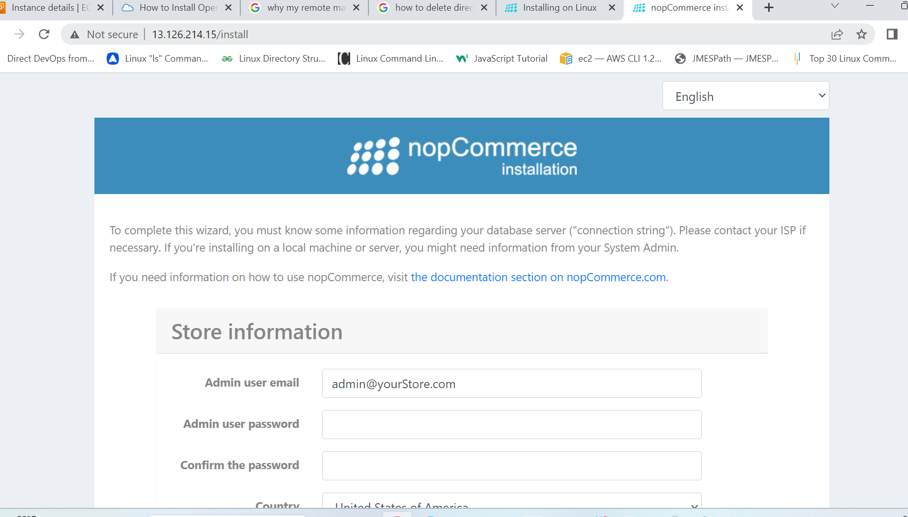

## play book for nopcommerce
1. Follow the documentation of the below link to proceed with installation

2. [Refer here] https://docs.nopcommerce.com/en/installation-and-upgrading/installing-nopcommerce/installing-on-linux.html

3. Follow the method called WOW(WAYS OF WORKING)
       Install the application manually.
       Take the ansible node to write playbooks.
       Execute the playbooks.

4. NOPCOMMERCE runs on .net 

5. we need nginx server to run nopcommerce. It is the best reverse proxy server used in many applications.

6. The playbook for nopcommerce is as follows
```
---
- name: nop commerce
  hosts: all
  become: yes
  tasks:
    - name: Register microsoft key
      ansible.builtin.get_url:
        url: https://packages.microsoft.com/config/ubuntu/20.04/packages-microsoft-prod.deb
        dest: /tmp/packages-microsoft-prod.deb
    - name: package dpkg
      ansible.builtin.dpkg_selections:
        name: packages-microsoft-prod.deb
        selection: install
    - name: Install apt transports
      ansible.builtin.package:
        name:
         - apt-transport-https
         - aspnetcore-runtime-7.0
         - zip
        update_cache: yes
        state: present
    - name: Install nginx
      ansible.builtin.apt:
        name: nginx
        state: present
    - name: Status nginx
      ansible.builtin.systemd:
        name: nginx
        state: started
    - name: copy the configuration file
      ansible.builtin.copy:
        src: default
        dest: /etc/nginx/sites-available/
    - name: create directory
      ansible.builtin.file:
        path: /var/www/nopCommerce
        state: directory
    - name: Download nopcommerce
      ansible.builtin.get_url:
        url: https://github.com/nopSolutions/nopCommerce/releases/download/release-4.60.3/nopCommerce_4.60.3_NoSource_linux_x64.zip
        dest: /var/www/nopCommerce
    - name: Unzip nopcommerce
      ansible.builtin.unarchive:
        src: /var/www/nopCommerce/nopCommerce_4.60.3_NoSource_linux_x64.zip
        dest: /var/www/nopCommerce
        remote_src: yes
    - name: Create directory bin
      ansible.builtin.file:
        path: /var/www/nopcommerce/bin
        state: directory
    - name: create directory logs
      ansible.builtin.file:
        path: /var/www/nopCommerce/logs
        state: directory
    - name: changing ownership and group
      ansible.builtin.file:
        path: /var/www/nopCommerce
        owner: www-data
        group: www-data
        recurse: yes
    - name: nop commerce service file
      ansible.builtin.copy:
        src: /home/devops/playbooks/nopcommerce.service
        dest: /etc/systemd/system/
        remote_src: no
    - name: start nopcommerce
      ansible.builtin.systemd:
       name: nopcommerce.service
       state: started
    - name: restart nginx
      ansible.builtin.systemd:
       name: nginx
       state: restarted

```
When the playbook is executed it displays as follows



Copy the public ip of node1 and paste in browser 

The output of nopcommerce on the browser is as follows


