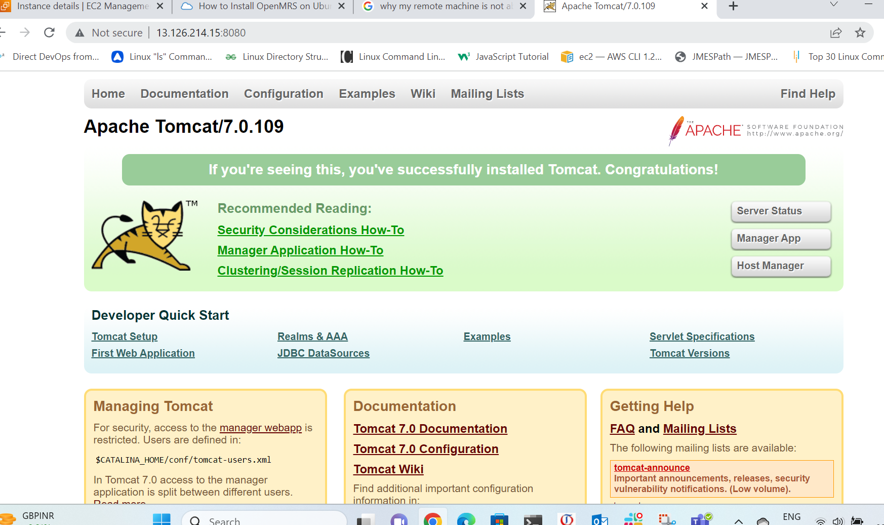

## Writing a playbook for the application called OPENMRS.

1.openmrs works on java and runs on apache tomcat.

2.so we need to install java and then install tomcat server
after that we need to install openmrs application.

3.Tomcat runs on 8080 port.

4.created group_vars folder to include all the variables

5.created hosts in group_vars where the hostname is tomcat with (private ipaddress of node1).

6.created a service file called tomcat.service.j2 which is a template called jinja2 template.

7.Ansible uses variables to manage differences between systems.

8.With Ansible, you can execute tasks and playbooks on multiple different systems with a single command. 

9.To represent the variations among those different systems, you can create variables.

10.Here templates are used in case of files.

11.Jinja2 template is used enable dynamic expressions and access to variables.

12.Created tomcat.yaml(groupname.yml) file where in all the variables are kept.

The playbook is as follows

        ---
        - name: install tomcat
        hosts: tomcat
        become: yes
        tasks:
            - name: Install java
            ansible.builtin.apt:
                name: "{{ java_package }}"
                update_cache: yes
                state: present
            - name: group add tomcat
            ansible.builtin.group:
                name: "{{ group }}"
                state: present
            - name: create user
            ansible.builtin.user:
                name: "{{ user }}"
                create_home: yes
                state: present
                home: "{{ homedir }}"
                shell: "{{ shell }}"
                group: "{{ group }}"
            - name: Download tomcat
            ansible.builtin.get_url:
                url: https://archive.apache.org/dist/tomcat/tomcat-7/v7.0.109/bin/apache-tomcat-7.0.109.tar.gz
                dest: /tmp/apache-tomcat-7.0.109.tar.gz
            - name: create a directory
            ansible.builtin.file:
                path: "{{ homedir }}"
                state: directory
            - name: Extract tomcat
            ansible.builtin.unarchive:
                src: /tmp/apache-tomcat-7.0.109.tar.gz
                dest: "{{ homedir }}"
                remote_src: yes
                extra_opts:
                --strip-components=1
            - name: changing group of directory
            ansible.builtin.file:
                path: "{{ homedir }}"
                state: directory
                recurse: yes
                owner: "{{ user }}"
                group: "{{ group }}"
            - name: setting permissions
            ansible.builtin.file:
                path: conf
                state: directory
                recurse: yes
                owner: "{{ user }}"
                group: "{{ group }}"
                mode: g+xr
            - name: setting permissions11
            ansible.builtin.file:
                path:
                - webapps/
                - work/
                - temp/
                - logs/
                state: directory
                recurse: yes
                owner: "{{ user }}"
                group: "{{ group }}"

            - name: changing ownership of directory
            ansible.builtin.file:
                path: "{{ homedir }}"
                state: directory
                recurse: yes
                owner: "{{user}}"
                group: "{{group}}"
            - name: copy the service file
            ansible.builtin.template:
                src: ./group_vars/tomcat.service.j2
                dest: /etc/systemd/system/tomcat.service
            notify:
            - reload daemon
            - name: ensure tomcat is enable and running
            ansible.builtin.systemd:
                name: tomcat
                enabled: yes
                state: started
            - name: changing owner ship of openmrs
            ansible.builtin.file:
                path: /var/lib/OpenMRS
                state: directory
                recurse: yes
                owner: "{{ user }}"
                group: "{{ group }}"
            - name: download openmrs
            ansible.builtin.get_url:
                url: https://sourceforge.net/projects/openmrs/files/releases/OpenMRS_Platform_2.5.0/openmrs.war
                dest: /tmp/openmrs.war
            - name: copy openmrs
            ansible.builtin.copy:
                src: /tmp/openmrs.war
                dest: "{{ homedir }}/webapps"
                remote_src: yes
            - name: changing ownership of openmrs
            ansible.builtin.file:
                path: "{{ homedir }}/webapps/"
                recurse: yes
                owner: "{{ user }}"
                group: "{{ group }}"
        handlers:
            - name: reload daemon
            ansible.builtin.systemd:
                daemon_reload: yes

copy the public ipaddress of the node into the browser with 8080 port tomcat page will be displayed

playbook execution:

The output of the openmrs application is as follows

    