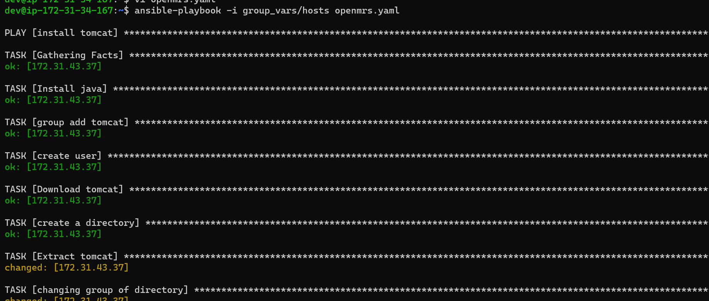
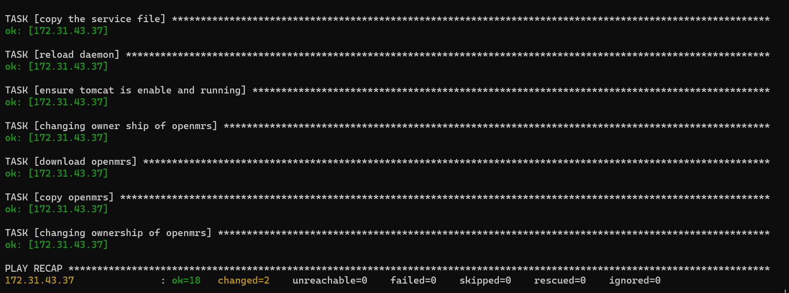
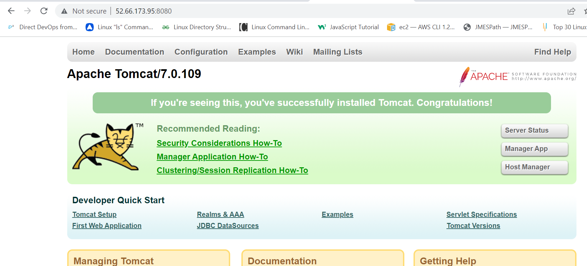
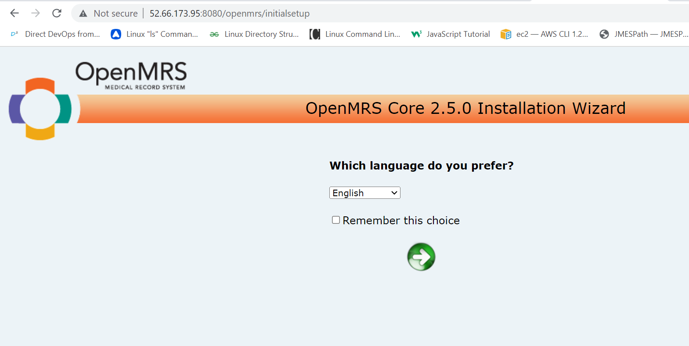

## writing a playbook for openmrs application

[refer here] https://www.linuxcloudvps.com/blog/how-to-install-openmrs-on-ubuntu-20-04/ for official documentation.

openmrs needs java with apache tomcat server which runs on 8080 port.

The playbook for openmrs application is as follows
```
---
- name: install tomcat
  hosts: all
  become: yes
  tasks:
    - name: Install java
      ansible.builtin.apt:
        name: "{{ java_package }}"
        update_cache: yes
        state: present
    - name: group add tomcat
      ansible.builtin.group:
        name: "{{ group }}"
        state: present
    - name: create user
      ansible.builtin.user:
        name: "{{ user }}"
        create_home: yes
        state: present
        home: "{{ homedir }}"
        shell: "{{ shell }}"
        group: "{{ group }}"
    - name: Download tomcat
      ansible.builtin.get_url:
        url: https://archive.apache.org/dist/tomcat/tomcat-7/v7.0.109/bin/apache-tomcat-7.0.109.tar.gz
        dest: /tmp/apache-tomcat-7.0.109.tar.gz
    - name: create a directory
      ansible.builtin.file:
        path: "{{ homedir }}"
        state: directory
    - name: Extract tomcat
      ansible.builtin.unarchive:
        src: /tmp/apache-tomcat-7.0.109.tar.gz
        dest: "{{ homedir }}"
        remote_src: yes
        extra_opts:
          --strip-components=1
    - name: changing group of directory
      ansible.builtin.file:
        path: "{{ homedir }}"
        state: directory
        recurse: yes
        owner: "{{ user }}"
        group: "{{ group }}"
    - name: setting permissions
      ansible.builtin.file:
        path: conf
        state: directory
        recurse: yes
        owner: "{{ user }}"
        group: "{{ group }}"
        mode: g+xr
    - name: setting permissions11
      ansible.builtin.file:
        path:
          - webapps/
          - work/
          - temp/
          - logs/
        state: directory
        recurse: yes
        owner: "{{ user }}"
        group: "{{ group }}"
    - name: changing ownership of directory
      ansible.builtin.file:
        path: "{{ homedir }}"
        state: directory
        recurse: yes
        owner: "{{user}}"
        group: "{{group}}"
    - name: copy the service file
      ansible.builtin.template:
        src: ./group_vars/tomcat.service.j2
        dest: /etc/systemd/system/tomcat.service
    - name: reload daemon
      ansible.builtin.systemd:
         daemon_reload: yes
    - name: ensure tomcat is enable and running
      ansible.builtin.systemd:
        name: tomcat
        enabled: yes
        state: started
    - name: changing owner ship of openmrs
      ansible.builtin.file:
        path: /var/lib/OpenMRS
        state: directory
        recurse: yes
        owner: "{{ user }}"
        group: "{{ group }}"
    - name: download openmrs
      ansible.builtin.get_url:
        url: https://sourceforge.net/projects/openmrs/files/releases/OpenMRS_Platform_2.5.0/openmrs.war
        dest: /tmp/openmrs.war
    - name: copy openmrs
      ansible.builtin.copy:
        src: /tmp/openmrs.war
        dest: "{{ homedir }}/webapps/"
        remote_src: yes
    - name: changing ownership of openmrs
      ansible.builtin.file:
        path: "{{ homedir }}/webapps/"
        recurse: yes
        owner: "{{ user }}"
        group: "{{ group }}"

```
The output for playbook executed is as follows



check with the public ipaddress of the node in the browser with 8080 port.



The final output of openmrs application is as follows.

