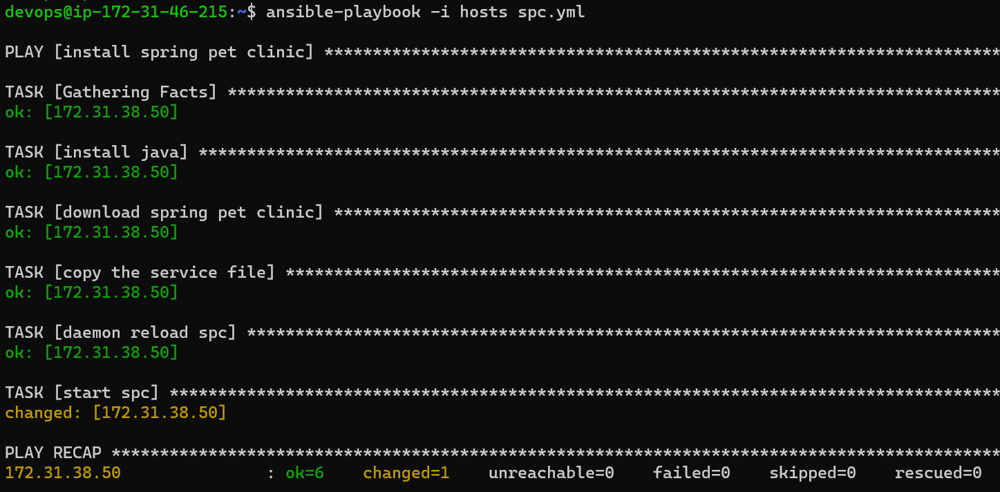
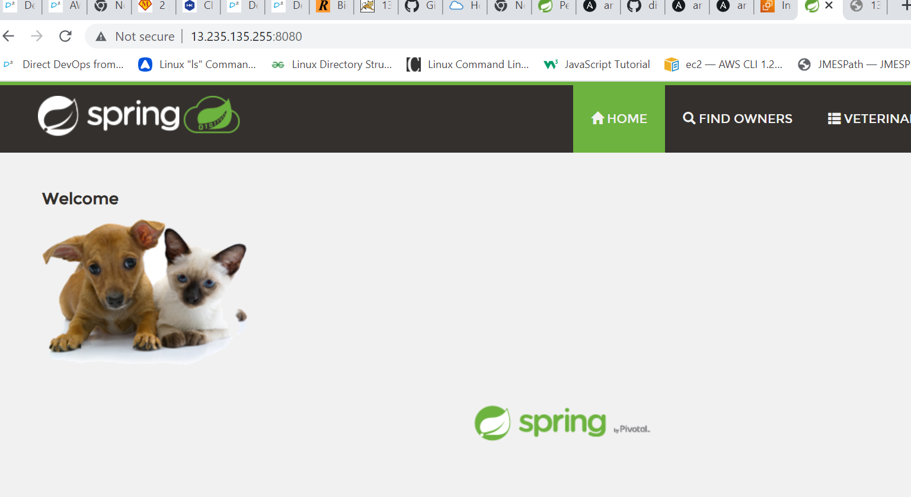

### playbook for sring pet clinic

```
---
- name: install spring pet clinic
  become: yes
  hosts: all
  tasks:
   - name: install java
     ansible.builtin.apt:
       name: openjdk-11-jdk
       update_cache: yes
       state: present
   - name: download spring pet clinic
     ansible.builtin.get_url:
       url: https://referenceapplicationskhaja.s3.us-west-2.amazonaws.com/spring-petclinic-2.4.2.jar
       dest: /home/devops/spring-petclinic-2.4.2.jar
   - name: copy the service file
     ansible.builtin.copy:
       src: /home/devops/spc.service
       dest: /etc/systemd/system
   - name: daemon reload spc
     ansible.builtin.systemd:
       daemon_reload: true
   - name: start spc
     ansible.builtin.systemd:
       name: spc.service
       state: started
       enabled: true

```
execute the command
`ansible-playbook i hosts spc.yml`

The output of the playbook is 



The output of application is 


