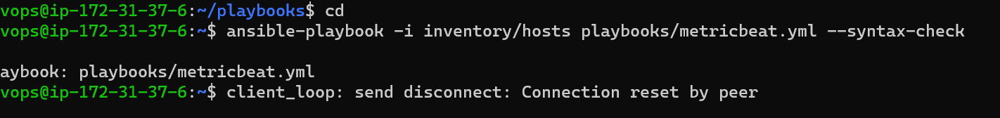
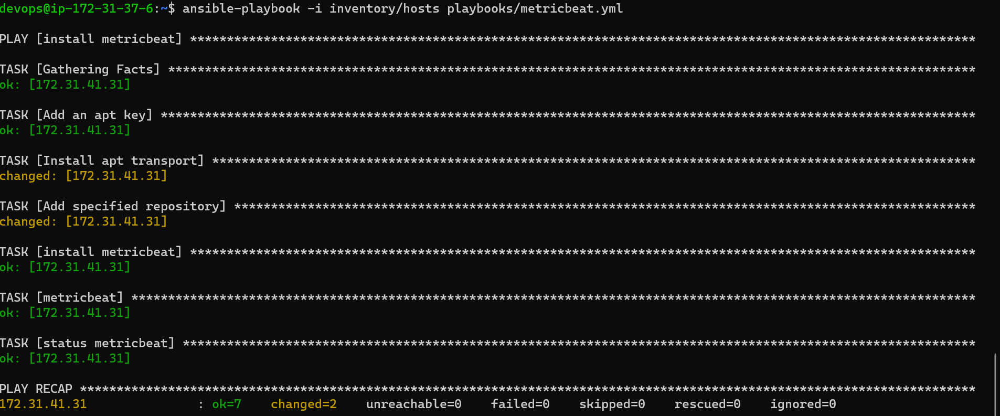
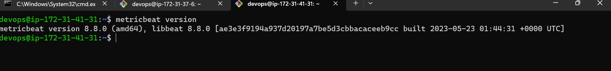

check out for the syntax errors using command
   ansible-playbook -i inventory/hosts playbooks/metricbeat.yml --syntax-check
   output is as follows
    
Execute the playbook and output is as follows
    
cross check the metricbeat installation in node1
   