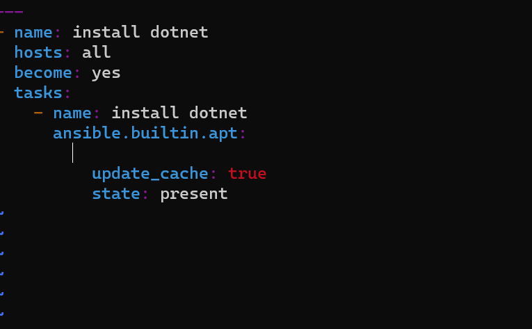

# what is playbook in Ansible?
  Ansible Playbooks are lists of tasks that automatically execute against hosts.
  we create a file where we express our desired state.

---

# Installing java,dotnet and nginx through ansible control node

1.create two vms
2.one is ansible control node and the other is node1 
3.create a user called devops on both the machines using command 
          `sudo adduser <username>`
4.Give sudo permissions for the user(devops) created.
        execute `sudo visudo` 
5.Set password authentication for the user(devops) created using 
        `sudo vi /etc/ssh/sshd_config`
6.Set password authentication to `yes` from `no`
7.Now login as user(devops) from ansible control node and generate the key.
        `ssh-keygen`
8.copy the key to the user(devops) created in node1 using
         `ssh-copy-id user(devops)@ipaddress`
9.Install ansible in ansible control node with the following steps
          `sudo apt update`
          `sudo apt install software-properties-common -y`
          `sudo add-apt-repository --yes --update ppa:ansible/ansible`
          `sudo apt install ansible`
10.Here ansible can communicate with the nodes through playbooks.
11.Connect another vm or node created using private ipaddress (if they r in the same n/w or region) public ipaddress (if they r out of n/w or another region).

## Playbook for java

12. Create two directories and name them as inventory and playbooks.
    
13. In inventory create a file called as `hosts` and give the node1 private ipaddress and in playbooks directory create a file called `java.yml`where we usually write playbooks.

  
14. execute the following command to check the hosts pinging
    
   `ansible -i hosts -m ping all`

check with the syntax 

`ansible-playbook -i <inventory_path> <playbook_path> --syntax-check`
 
 Run the following command to execute playbook.

`ansible-playbook -i <inventory_path> <playbook_path>`

playbook of java file got executed and the output is as follows
15.   

Cross check the java version in node1.
16.  

## Playbook for dotnet

Create a file called dotnet.yml in playbooks directory.

ping hosts to check connectivity

`ansible -i hosts -m ping all`

check with the syntax 

`ansible-playbook -i <inventory_path> <playbook_path> --syntax-check`
 
 Run the following command to execute playbook.

`ansible-playbook -i <inventory_path> <playbook_path>`

playbook of dotnet file got executed and the output is as follows

Cross check the dotnet installation in node1

## Playbook for Nginx

reate a file called Nginx.yml in playbooks directory.

ping hosts to check connectivity

`ansible -i hosts -m ping all`

check with the syntax 

`ansible-playbook -i <inventory_path> <playbook_path> --syntax-check`
 
 Run the following command to execute playbook.

`ansible-playbook -i <inventory_path> <playbook_path>`

playbook of dotnet file got executed and the output is as follows

Cross check the dotnet installation in node1

  