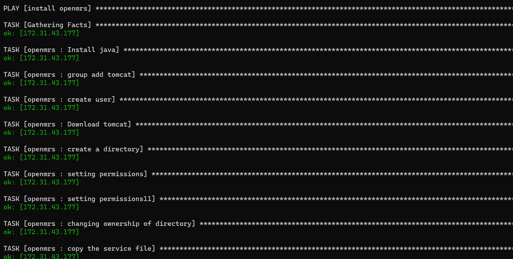

### creating a role for openmrs application

* [refer here]https://www.linuxcloudvps.com/blog/how-to-install-openmrs-on-ubuntu-20-04/ for manual steps 

* created a role called openmrs.

* The following is the playbook for role `openmrs`

```
- name: install openmrs
  become: yes
  hosts: tomcat
  roles:
    - openmrs
  
```
* The execution of playbook is as follows




* The output of the tomcat is 

* 

* The openmrs application will be displayed as below
* 


